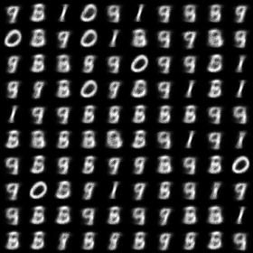
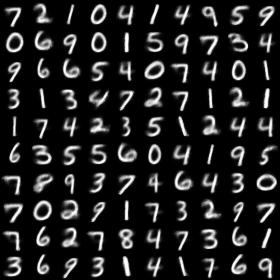
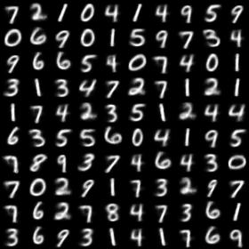
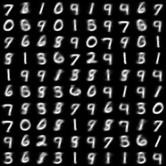
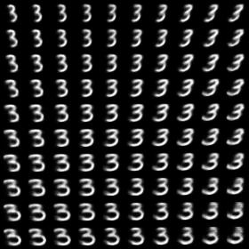
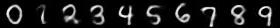

# Conditional Variational Auto-Encoder for MNIST
An implementation of conditional variational auto-encoder (CVAE) for MNIST descripbed in the paper:  
* [Semi-Supervised Learning with Deep Generative Models](https://arxiv.org/abs/1406.5298) by Kingma et al.

## Implemented Models  
The paper suggests three models. 
* Latent Discriminative Model (M1) : M1 is the same as in [Auto-Encoding Variational Bayes](https://arxiv.org/pdf/1312.6114), and my implementation is given at [here](https://github.com/hwalsuklee/tensorflow-mnist-VAE).  
* Generative Semi-Supervised model (M2) : M2 is implemented in here but with full labeled data. My concern is not classification performance of semi-supervised model, but effect of condition vector.  
* Stacked model (M1+M2) : This is not implemented.

## Results
### Reproduce
Well trained auto-encoder must be able to reproduce input image.  
Since CVAE uses additional information (labels) which is not used in VAE, CVAE shows better performance than CVAE.  
The following results can be reproduced with command:  
```
python run_main.py --dim_z 2
``` 
<table align='center'>
<tr align='center'>
<td> </td>
<td> Input image </td>
<td> CVAE </td>
<td> VAE </td>
</tr>
<tr>
<td> Epoch 1 </td>
<td>
<td>
<td>
</tr>
<tr>
<td> Epoch 20 </td>
<td>
<td>
<td>
</tr>
</table>

### Denoising

When training, salt & pepper noise is added to input image, so that CVAE can reduce noise and restore original input image.  
The following results can be reproduced with command:  
```
python run_main.py --dim_z 2 --add_noise True
```
<table align='center'>
<tr align='center'>
<td> Original input image </td>
<td> Input image with noise </td>
<td> Restored image via CVAE </td>
<td> Restored image via VAE </td>
</tr>
<tr>
<td>
<td>
<td>
<td>
</tr>
</table>

### Conditional Generation : Learned MNIST manifold
Visualisation of handwriting styles learned by the model with 2D z-space in Figure. 1(a) in the paper.
The following results can be reproduced with command:  
```
python run_main.py --dim_z 2 --PMLR True
```
<table align='center'>
<tr align='center'>
<td> Learned MNIST manifold with a condition of label 2</td>
<td> Learned MNIST manifold with a condition of label 3</td>
<td> Learned MNIST manifold with a condition of label 4</td>
</tr>
<tr>
<td>
<td>
<td>
</tr>
</table>

### Conditional Generation : Analogical reasoning with random z-vectors
Analogical reasoning with generative semi-supervised models using a 2D z-space like in Figure. 1(b) in the paper.
The following results can be reproduced with command:  
```
python run_main.py --dim_z 2 --PARR True
```
<table align='center'>
<tr align='center'>
<td>
</tr>
</table>

The leftmost columns show images randomly selected from the test set. The other columns show analogical fantasies
of x by the generative model, where the latent variable z of each row is set to the value inferred from
the test-set image on the left by the inference network.

### Conditional Generation : Analogical reasoning with a given image
CVAE encodes a given handwritten digit image to a z-vector. With an obtained z-vector, various images with similar style to the given image can be generated by changing label-condition.

<table align='center'>
<tr align='center'>
<td> input </td>
<td> generated images </td>
</tr>
<tr>
<td>
<td>
</tr>
</table>

## Usage
### Prerequisites
1. Tensorflow
2. Python packages : numpy, scipy, PIL(or Pillow), matplotlib

### Command
```
python run_main.py --dim_z <latent vector dimension>
```
*Example*:
`python run_main.py --dim_z 20`

### Arguments
*Required* :  
* `--dim_z`: Dimension of latent vector. *Default*: `20`

*Optional* :  
* `--results_path`: File path of output images. *Default*: `results`
* `--add_noise`: Boolean for adding salt & pepper noise to input image. *Default*: `False`
* `--n_hidden`: Number of hidden units in MLP. *Default*: `500`
* `--learn_rate`: Learning rate for Adam optimizer. *Default*: `1e-3`
* `--num_epochs`: The number of epochs to run. *Default*: `20`
* `--batch_size`: Batch size. *Default*: `128`
* `--PRR`: Boolean for plot-reproduce-result. *Default*: `True`
* `--PRR_n_img_x`: Number of images along x-axis. *Default*: `10`
* `--PRR_n_img_y`: Number of images along y-axis. *Default*: `10`
* `--PRR_resize_factor`: Resize factor for each displayed image. *Default*: `1.0`
* `--PMLR`: Boolean for plot-manifold-learning-result. *Default*: `False`
* `--PMLR_n_img_x`: Number of images along x-axis. *Default*: `10`
* `--PMLR_n_img_y`: Number of images along y-axis. *Default*: `10`
* `--PMLR_resize_factor`: Resize factor for each displayed image. *Default*: `1.0`
* `--PMLR_z_range`: Range for unifomly distributed latent vector. *Default*: `2.0`
* `--PMLR_n_samples`: Number of samples in order to get distribution of labeled data. *Default*: `5000`
* `--PARR`: Boolean for plot-analogical-reasoning-result. *Default*: `False`
* `--PARR_resize_factor`: Resize factor for each displayed image. *Default*: `1.0`
* `--PARR_z_range`: Range for unifomly distributed latent vector. *Default*: `2.0`

## References
The implementation is based on the projects:  
[1] https://github.com/wiseodd/generative-models/tree/master/VAE/conditional_vae  
[2] http://wiseodd.github.io/techblog/2016/12/17/conditional-vae/

## Acknowledgements
This implementation has been tested with Tensorflow r0.12 on Windows 10.
